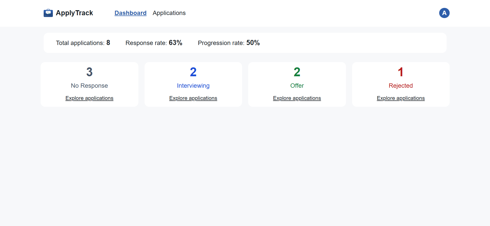
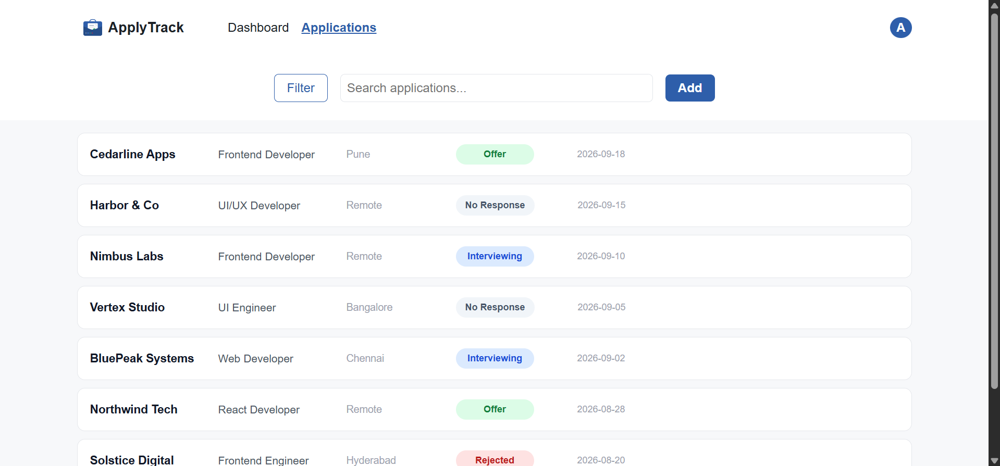
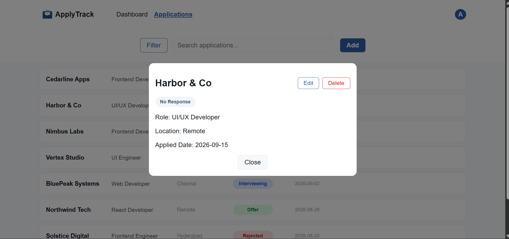

# ApplyTrack

ApplyTrack is a responsive job application tracking dashboard built with React and Firebase. It helps users organize applications, monitor their progress, and understand their job search through dashboard statistics.

## Features

- User authentication with Firebase Authentication
- Protected dashboard and application routes
- Create, view, edit, and delete job applications
- Application statuses and status-based filtering
- Live application search with highlighted matches
- Dashboard statistics:
  - Total applications
  - Response rate
  - Progression rate
- URL-synchronized application details modal
- Loading skeletons and authentication loading states
- Empty states for dashboards and application lists
- Error and offline handling with retry actions
- Responsive mobile-first layout
- Accessible dialogs and form interactions
- Keyboard-friendly application list controls
- Form validation for required fields

## Tech Stack

- React
- React Router
- Firebase Authentication
- Cloud Firestore
- JavaScript
- CSS
- Vite
- ESLint

## Screenshots

Add screenshots of the main application screens here.

### Dashboard



### Applications



### Application modal




## Live Demo

[View the live application](YOUR_DEPLOYED_APP_URL)

## Getting Started

### Prerequisites

Make sure you have installed:

- Node.js
- npm
- A Firebase project

### Installation

Clone the repository:

```bash
git clone https://github.com/adharshko-369z/ApplyTrack.git
```

Move into the project directory:

```bash
cd ApplyTrack
```

Install dependencies:

```bash
npm install
```

### Environment Variables

Create a `.env` file in the project root:

```env
VITE_FIREBASE_API_KEY=your_firebase_api_key
VITE_FIREBASE_AUTH_DOMAIN=your_firebase_auth_domain
VITE_FIREBASE_PROJECT_ID=your_firebase_project_id
VITE_FIREBASE_STORAGE_BUCKET=your_firebase_storage_bucket
VITE_FIREBASE_MESSAGING_SENDER_ID=your_firebase_messaging_sender_id
VITE_FIREBASE_APP_ID=your_firebase_app_id
VITE_FIREBASE_MEASUREMENT_ID=your_firebase_measurement_id
```

Do not commit your `.env` file. Make sure it is included in `.gitignore`.

### Firebase Setup

1. Create a project in the [Firebase Console](https://console.firebase.google.com/).
2. Enable the authentication providers used by the application.
3. Create a Cloud Firestore database.
4. Add your Firebase configuration values to the `.env` file.
5. Configure Firestore security rules before deploying the application.

### Run the Development Server

```bash
npm run dev
```

Open the local development URL shown in your terminal.

## Available Scripts

```bash
npm run dev
```

Starts the Vite development server.

```bash
npm run build
```

Creates a production build.

```bash
npm run preview
```

Previews the production build locally.

```bash
npm run lint
```

Runs ESLint to check the codebase.

## Project Structure

```text
src/
├── assets/
├── components/
│   ├── application-components/
│   ├── loading-components/
│   ├── AppLayout.jsx
│   ├── AuthLayout.jsx
│   └── Header.jsx
├── config/
├── constants/
├── context/
├── hooks/
├── pages/
├── styles/
├── utils/
├── App.jsx
└── main.jsx
```

## Accessibility

ApplyTrack includes accessibility-focused improvements such as:

- Semantic buttons for interactive application items
- Keyboard-accessible controls
- Accessible dialog semantics
- Focus management for modals
- Focus trapping inside dialogs
- Form labels and validation
- Status and error announcements
- Visible keyboard focus indicators
- Responsive layouts for different screen sizes

The application was reviewed using keyboard navigation and common accessibility considerations.

## Responsive Design

ApplyTrack follows a mobile-first approach and is designed to work across:

- Mobile devices
- Tablets
- Desktop screens

The layout was tested at narrow mobile widths as well as tablet and desktop breakpoints.

## Key Challenges Solved

### Separating loading, empty, and error states

During development, a real network interruption exposed an issue where the application could display the empty state when Firebase was unavailable.

The state handling was improved to distinguish between:

- Data still loading
- A failed or offline request
- A successful response with no applications
- A successful response containing applications

This allows the application to show the correct UI and provide a retry action when necessary.

### Reusable application logic

Application data operations were extracted into a reusable `useApplications` hook. Dashboard calculations and search highlighting were also separated into utilities to make the components easier to maintain.

## License

This project is currently available for learning and portfolio purposes.

## Author

**Adharsh K O**

- GitHub: [@adharshko-369z](https://github.com/adharshko-369z)
- Repository: [ApplyTrack](https://github.com/adharshko-369z/ApplyTrack)